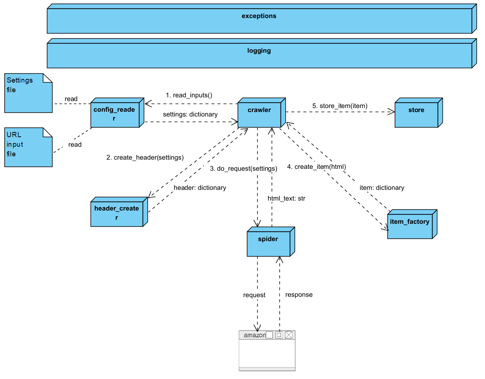

# AWSWebcrawler
This project is developed by a team of college students of the Technical University Ingolstadt. 
The goal is to create python program that is capable of scraping a defined amazon product webpage and 
extract specified values like the product name, the price, the seller and more.

Those values should be collected and stored at regular intervals to serve as a basis for data analysis.  
Possible questions that could be answered by these analyses are:
* Is there a difference in price depending on which device you use to access the site?
* How does the price of products change over time? 
* Can we recognize pricing policy patterns?
* Can we spot proven pricing policies in our data and confirm them?
# How To Use?
The URLs to be scraped must be entered in the url input file and 
in the settings file you must define your desired settings.
The program can then simply be started by calling the crawler.py script.

# Architecture


## crawler
The crawler module is the heart of the scraper application. As the "main script" it controls the logic 
of the entire scraping process.
The logic actually consists of a few simple calls to other modules:
### 1. read_input()
Calling the config_reader to get the settings and urls from the input files.
Receives a dictionary with mentioned parameters.
### 2. create_header(settings)
Calling the header_creater modul to get the header that matches the settings returned by the config_reader.
Receives a dictionary with the header parameters.
### 3. do_reqeust(settings)
Calling the spider module to initiate a web request. Receives the html response back.
### 4. create_item(html)
Calling the item_factory to get an item (amazon product with its attributes) in form of a dictionary.
### 5. store_item(item)
Storing the item by calling the store module.

After those method calls the crawler script terminates.

## config_reader

Reads the data from the config files and saves them in a dictionary which also serves as the return value. 
In addition, the config_reader checks whether the specified settings and URLs are valid at all.

Example structure of the dictionary:
```
{"urls" : ["https://www.amazon.de/dp/B09PG9Y8MS/",
          "https://www.amazon.de/dp/B07D79K2SS/",
          "https://www.amazon.de/dp/3864900077/"],
 "browser" : "chrome",
 "browser-version" : "Version 101.0.4951.41",
 "device" : "windows"
}       
```

## header_creater
Generates a header for the subsequent web request based on the settings dictionary.
Returns the header information as a dictionary.

## spider
The spider takes care of the complete logic for the web request. In the simple form,
a request is created via the python reqeusts module and the html-text from the resulting response is returned. 
In order to bypass possible IP blocking, the use of a proxy service or a "ScraperAPI" is necessary. 
The spider module will then also take care of these services. 

## item_factory
The item factory parses the passed html text and extracts the desired attributes. The attributes are then stored in a 
dictionary and returned. 

## store
The Store module takes on the task that is already suggested by the name.
The goal for this module is to detect whether you are on a local machine or in an AWS environment based on 
environment variables. The correct storage method is then automatically selected either as a 
csv file (local) or in an S3 bucket (AWS).

